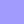
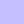
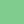

# Poku Theme ✨

A cute **gothic pastel** theme inspired by [**Poku**](https://github.com/wellwelwel/poku)'s visual identity for [Visual Studio Code](https://github.com/microsoft/vscode).

💡 While [**Poku Test Runner**](https://github.com/wellwelwel/poku) makes testing easier, **Poku**'s theme makes it easy to read your code.

---

## Languages Tried

- ✅ **JavaScript**, **TypeScript**
  - ✅ **React.js**, **Stelve**, **Vue**
- ✅ **HTML**, **CSS**, **SCSS**, **JSON**, **YAML**, **Markdown**
- ✅ **SQL**, **Bash**
- ✅ **PHP**, **C++**, **Go**, **Python**, **Ruby**

Soon:
 - **Rust**, **Dart**, **Flutter**, and **Astro**.

> Although it probably works with most languages, these are the languages and frameworks that are manually checked.

---

# Main Color Palette 🎨🐷

This section describes the theme’s core color palette. It serves as a guide for developers who want to adapt the **Poku Theme** to other editors, variations or tools beyond **VSCode**.

---

## 🌌 Dark Theme

### 1. Editor Backgrounds and Main Surfaces

| Purpose                       | HEX       | 👨🏻‍🎨                                       | Notes                                                  |
| ----------------------------- | --------- | ---------------------------------------- | ------------------------------------------------------ |
| **Editor / Code**             | `#2c313b` |  | Primary background where the code is displayed.        |
| **Title Bar / Inactive Tabs** | `#22242c` |  | Background for the window title bar and inactive tabs. |
| **Sidebar / Explorer**        | `#1b1f25` |  | Background for the sidebar and the file explorer.      |
| **Status Bar (normal)**       | `#443ca7` |  | Bottom status bar (normal mode).                       |
| **Status Bar (debugging)**    | `#8b34be` |  | Bottom status bar (debugging mode).                    |

---

### 2. Text and General Elements

| Purpose                          | HEX         | 👨🏻‍🎨                                         | Notes                                                                      |
| -------------------------------- | ----------- | ------------------------------------------ | -------------------------------------------------------------------------- |
| **Primary Text**                 | `#babcc4`   |    | Main text color inside the editor.                                         |
| **Secondary Text**               | `#96a3b6`   |    | Used in the sidebar items, breadcrumb, etc.                                |
| **Strings / Insertions**         | `#98aec9`   |    | Strings, template strings, inserted code blocks.                           |
| **Comments**                     | `#596170`   |    | Used for code comments, docblocks, etc.                                    |
| **Logical Operators**            | `#9294ff`   |    | Logical / comparison operators (`&&`, `==`, etc.).                         |
| **Keywords**                     | `#a29bfe`   |    | Covers `keyword`, `storage`, `control`, etc. (sometimes italic).           |
| **Functions / Methods**          | `#c5bfff`   |    | Function names, `meta.function-call`, methods, constructors, etc.          |
| **Variables**                    | `#8dc0ff`   |    | Local/global variables, placeholders in strings.                           |
| **Native properties and values** | `#38a2ff`   |    | Built-in properties _(`this`, `lenght`, `null`, etc.)_.                    |
| **Classes**                      | `#0fb9b1`   |    | Classes, including **JSX**, **Vue**, **Stelve**, and **Astro** components. |
| **Types**                        | `#0fb9b0d1` |  | Types, annotations, etc. (often _italic_).                                 |
| **Numbers / Units**              | `#80cc8f`   |    | Numeric constants, CSS units, etc. (often **bold**).                       |

These colors appear throughout **syntax highlighting**, driving legibility and consistent emphasis.

---

### 3. Accents / Specific Highlights

| Purpose                      | HEX         | 👨🏻‍🎨                                         | Notes                                                       |
| ---------------------------- | ----------- | ------------------------------------------ | ----------------------------------------------------------- |
| **Pink Accent / Decoration** | `#fd9fff`   |    | Used in special characters and other prominent decorations. |
| **Errors / Invalid**         | `#ff6e97`   |    | Used for `invalid.illegal`, lint errors, etc.               |
| **Search Highlight**         | `#5100ffdc` |  | Background for find match highlighting.                     |
| **Active Links**             | `#688eff`   |    | `editorLink.activeForeground`.                              |

These vibrant shades intensify the visual experience, highlighting errors, selections, links, etc.

---

### 4. Edtior Miscellaneous Colors

| Purpose                     | HEX         | 👨🏻‍🎨                                         |
| --------------------------- | ----------- | ------------------------------------------ |
| **Line Numbers (Inactive)** | `#51647d`   |    |
| **Line Numbers (Active)**   | `#948ef9`   |    |
| **Notifications (BG)**      | `#ffd3ed`   |    |
| **Notifications (FG)**      | `#821469`   |    |
| **Diff Editor (Removed)**   | `#e323902d` |  |
| **Diff Editor (Inserted)**  | `#45cf962d` |  |

---

## Theme Essence

The **Poku** Theme is defined by:

- **Dark background** with **light text**
- **Soft comments** in a subtle blue-gray
- **Lavender/purple keywords**
- **Strings / functions** in bluish-lilac tones
- **Selections** and **errors** highlighted in vibrant purple/pink
- **Occasional accents** in magenta and bright blues

Feel free to contribute improvements, new variations, languages and even editors.
